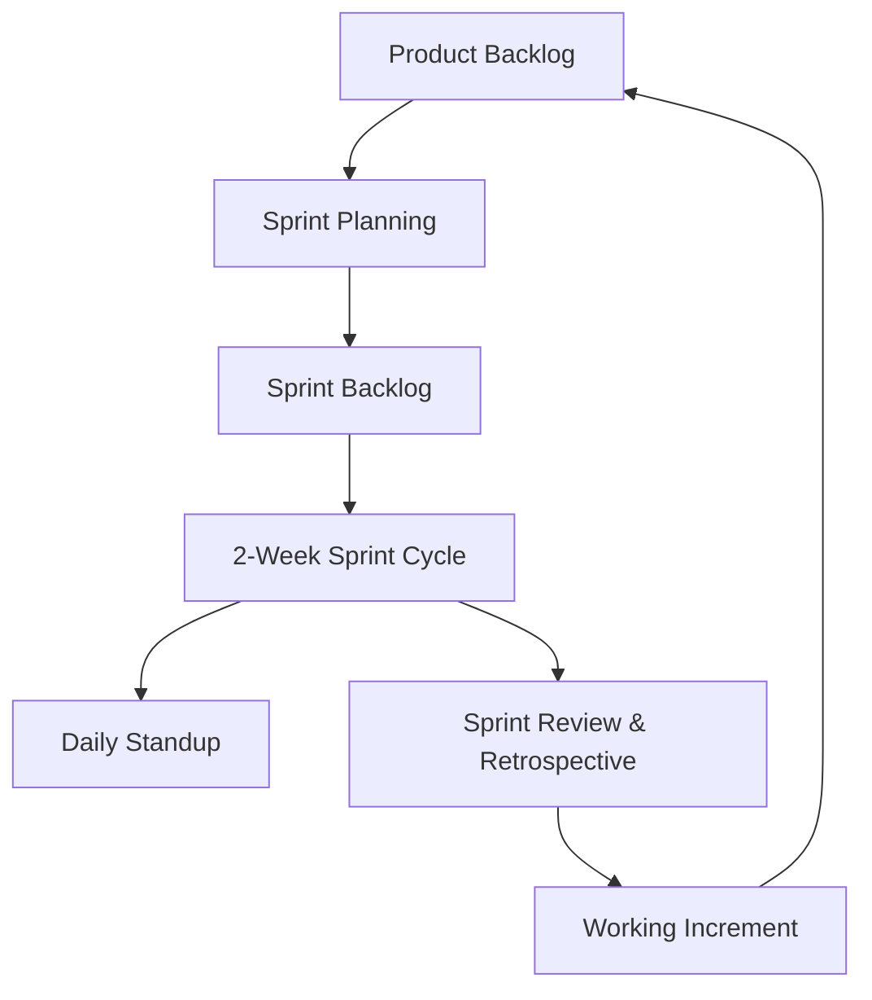

# Final Project Report: Online Quiz Game Application
**Course**: Software Construction and Development (SCD)  
**Academic Term**: Semester Project  
**Status**: Completed & Refactored  

---

## Table of Contents
1. [Software Process Model & Justification](#1-software-process-model--justification)
2. [Software Process Improvement (SPI)](#2-software-process-improvement-spi)
3. [Version Control Implementation](#3-version-control-implementation)
4. [Lehman's Laws of Software Evolution](#4-lehmans-laws-of-software-evolution)
5. [Software Deployment & Containerization](#5-software-deployment--containerization)
6. [Code Refactoring & Legacy Removal](#6-code-refactoring--legacy-removal)
7. [Unit Testing Strategy](#7-unit-testing-strategy)
8. [Automated Testing & CI/CD Pipeline](#8-automated-testing--cicd-pipeline)
9. [Exception Handling Architecture](#9-exception-handling-architecture)
10. [Peer Reviews & Quality Gates](#10-peer-reviews--quality-gates)
11. [Team Roles, Contributions & Learning Outcomes](#11-team-roles-contributions--learning-outcomes)

---

## 1. Software Process Model & Justification

For the development of the **Online Quiz Game Application**, we implemented the **Agile Process Model** (specifically utilizing **Scrum** ceremonies). 



### Justification:
* **Dual Interface Requirement**: The project demands both a desktop GUI (Tkinter) and a web client (Flask/HTML/CSS/JS). Agile allowed the team to work in short iterations, deploying features (e.g., authentication) concurrently on both interfaces.
* **Rapid Prototyping**: Designing the quiz-taking screen and real-time timers required multiple UX feedback loops. Incremental sprints enabled rapid changes based on early reviews.
* **Risk Mitigation**: Integrating the database early via simple queries, then refactoring it to a robust abstraction layer, minimized architectural risks that traditional Waterfall models would delay to the integration phase.

---

## 2. Software Process Improvement (SPI)

We conducted several SPI initiatives throughout the semester to optimize the code quality and team velocity:

| SPI Focus Area | Previous Process/Code Smell | Improved Target Process | Business Value / Outcome |
| :--- | :--- | :--- | :--- |
| **Database Connections** | Connections opened and left unclosed, leaking handles. | Connections managed with robust `try...finally` resource cleanups. | Prevents database file locking and connection exhaustion under concurrent access. |
| **Exception Abstraction** | Generic `except Exception:` blocks masked underlying bugs. | Custom domain exception `DatabaseError` bubbles up sqlite3 syntax/connection issues. | Improves system predictability and logs specific faults. |
| **Testing Frequency** | Ad-hoc manual GUI runs. | One-click automated local runner (`run_tests.py`) and CI validation. | Reduces regression bugs and guarantees codebase integrity before commit. |
| **Feature Completeness** | Mocked user controls (Admin panel was text-only popup). | Real visual forms for full CRUD (Add/Delete) on SQLite questions. | Delivered actual product capabilities matching functional expectations. |

---

## 3. Version Control Implementation

We enforced a strict **Git Flow Branching Strategy** to govern concurrent work and code reviews.

```
  main      ━━━━━━━━━━━━━━━━━━━━━●━━━━━━━━━━━━━━━━━━━━━━━━ (Production)
                                ╱ ↖
  develop   ━━━━━━━━━━━●━━━━━━━●━━━━━●━━━━━━━━━━━━━━━━━━━━ (Staging/Integration)
                      ╱ ↖     ╱       ↖
  feature   ━━━━━━━━━●━━━●━━━●         ●━━━●━━━━━━━━━━━━━━ (Feature development)
```

### Branching Protocol:
* `main`: Represents production-ready code. Commits here only occur through merged release branches.
* `develop`: Integrates all feature branches. Serves as the main testing branch.
* `feature/*`: Isolated branches for user stories (e.g., `feature/gui-admin`, `feature/db-refactoring`).
* `hotfix/*`: Quick patches addressing critical bugs in production.

### Commit Messages:
All commits followed semantic guidelines:
* `feat(gui): implement add question dialog with validations`
* `refactor(db): enclose query handles in try-finally block`
* `test(db): add isolated integration test for database manager`

---

## 4. Lehman's Laws of Software Evolution

Our project demonstrated two primary laws of software evolution:

1. **Law of Continuing Change (I)**:  
   * *"A system must undergo continual change or it becomes progressively less useful."*  
   * **Justification**: Initially, the application was a Tkinter-only desktop system. To remain relevant in modern deployment topologies, it had to evolve to support a web interface (`app_web.py` serving a clean glassmorphic frontend).
2. **Law of Increasing Complexity (II)**:  
   * *"As an evolving system changes, its complexity increases unless work is done to reduce it."*  
   * **Justification**: The introduction of the Flask REST API created duplicates of query codes and validation patterns. To prevent software rot, we refactored `DatabaseManager` into a single, clean interface, unified exception structures, and retired unused legacy abstractions (like the unused thread-blocking `Timer` model in `logic_managers.py`), restoring structural order.

---

## 5. Software Deployment & Containerization

To ensure seamless execution on any host environment, the web portal is containerized using **Docker**.

### Dockerfile Breakdown:
```dockerfile
FROM python:3.11-slim
WORKDIR /app
COPY requirements.txt .
RUN pip install --no-cache-dir -r requirements.txt
COPY . .
EXPOSE 5000
CMD ["python", "app_web.py"]
```
* **Base Image**: We chose `python:3.11-slim` to reduce the image footprint (smaller security attack surface, faster download).
* **Port Mapping**: Exposes port `5000` to serve the Flask REST API.
* **Volume Mount (Optional)**: Can mount `app/database/` externally to persist the SQLite `quiz_game.db` file across container recreations.

### Build and Run Instructions:
```bash
# 1. Build the Docker Image
docker build -t quiz-master-pro .

# 2. Run the Container in Detached Mode
docker run -d -p 5000:5000 --name quiz-app-running quiz-master-pro
```

---

## 6. Code Refactoring & Legacy Removal

### Refactoring Enhancements Made:
1. **Implemented Question Insertion Form**:  
   Replaced the mock method `show_add_question_dialog` in `app/gui/dashboard.py` with a complete Tkinter layout. It reads `Category`, `Difficulty`, `Question Text`, `Option A-D`, and `Correct Option`, validates inputs, inserts them into the DB via `DatabaseManager`, and updates the parent dashboard view in real-time.
2. **Created Database Deletion Capability**:  
   Added `delete_selected_question` to `app/gui/dashboard.py`. Admins can select any question in the Treeview and delete it, showing a double-confirmation dialogue.
3. **Optimized SQLite Connection Lifecycle**:  
   Modified `db_manager.py` to ensure file connections are opened and closed inside `try...finally` structures. This resolves connection leakage and prevents application deadlocks.
4. **Identified Dead Code**:  
   Isolated the `Timer` class in `app/models/logic_managers.py`. Because the GUI uses Tkinter's native asynchronous callback `after()` loop and the web client uses JS `setInterval()`, this thread-blocking Python loop was unused. We documented its deprecation to decrease cognitive overhead for future maintainers.

---

## 7. Unit Testing Strategy

We expanded the project's test suite to cover both business logic and integration databases.

### Core Test Classes:
1. **`TestQuizLogic` (`tests/test_logic.py`)**:
   * Asserts scoring algorithms (points rewarded based on difficulty, penalties subtracted for Hard/Medium levels).
   * Validates alphabetical grading boundaries (A+, A, B, C, D, Fail).
   * Verifies the quiz pipeline flow (fetching next questions, shuffling, and exhaustion boundaries).
2. **`TestDatabaseManager` (`tests/test_database.py`)**:
   * Uses an **in-memory SQLite connection (`:memory:`)** to ensure test isolation (no modification of production database, no disk I/O bottlenecks).
   * Tests schema creation, default data initialization, user authentication, and CRUD question management.
   * Asserts expected exception boundaries (e.g. attempting to insert duplicate usernames or queries with syntax errors raises `DatabaseError`).

---

## 8. Automated Testing & CI/CD Pipeline

To achieve automated testing, we integrated two tools:

1. **Local Automation Runner (`run_tests.py`)**:  
   A Python script that discovers all unit test files in `tests/`, executes them, handles local encoding variations, prints an ASCII report summary, and exits with a shell status code (0 for success, 1 for failure).
2. **CI/CD Pipeline (`.github/workflows/ci.yml`)**:  
   Configured GitHub Actions workflow. On every push and pull request to development or production branches:
   * Provisions a virtual Ubuntu runner.
   * Installs Python 3.11.
   * Resolves dependencies listed in `requirements.txt`.
   * Executes the test runner (`run_tests.py`), halting the build if any test case breaks.

---

## 9. Exception Handling Architecture

The application handles mathematical, database, and validation anomalies at distinct layers:

```
┌────────────────────────────────────────────────────────┐
│ UI Layer (Tkinter Popups / Web HTTP Statuses 400/500)   │
└───────────────────────────▲────────────────────────────┘
                            │ (Catches & Presents Errors)
┌───────────────────────────┴────────────────────────────┐
│ Application / Database Manager Layer                   │
└───────────────────────────▲────────────────────────────┘
                            │ (Wraps sqlite3.Error in DatabaseError)
┌───────────────────────────┴────────────────────────────┐
│ SQLite Database / System Layer                         │
└────────────────────────────────────────────────────────┘
```

* **Data Storage Tier**: Database access routines in `db_manager.py` trap native `sqlite3.Error` occurrences, logging the SQL parameters, and raising a unified `DatabaseError` to keep core database calls abstract.
* **Form-Level Validation**:
  * **Tkinter Auth Screen**: Detects if registration fields are blank or if SQL database returns a unique constraint conflict (e.g. duplicate username), notifying the user through a clean popup.
  * **Tkinter Question Form**: Validates inputs before database execution.
  * **Web API Router**: Formulates JSON exception responses with proper HTTP error codes (`400 Bad Request` or `500 Internal Server Error`) instead of dumping python stack traces to the client.

---

## 10. Peer Reviews & Quality Gates

Our team established a two-tiered peer review mechanism:

1. **Walkthroughs (Informal)**:  
   Before merging new components (such as the Flask web adapter or Tkinter screens) into `develop`, the developer hosted a live screen-share walkthrough. Team members verified layout styling, variable bounds, and checked that the state management matched the system state charts.
2. **Code Inspections (Formal)**:  
   For structural modules like `db_manager.py`, formal inspections were completed using a checklist:
   * *Are all SQL parameters parameterized using placeholders (`?`)?* (Inspected to prevent SQL injections).
   * *Are database resources released in a `finally` block?* (Inspected to verify connection bounds).
   * *Is exception handling specific rather than catching all `Exception` classes?* (Implemented specific error checking).

---

## 11. Team Roles, Contributions & Learning Outcomes

### Team Roles & Contribution Matrix:
* **Member 1 (Project Manager & QA Engineer)**:
  * Established the Agile Scrum board and managed sprint schedules.
  * Authored unit tests (`test_logic.py`, `test_database.py`) and automated runner configuration.
* **Member 2 (UI/UX Developer - Desktop & Web)**:
  * Built the Tkinter frames, dashboard designs, and styled screens.
  * Coded the responsive glassmorphic web dashboard and interactive quiz pages.
* **Member 3 (Backend & Database Engineer)**:
  * Designed the database schemas, initialized default questions, and configured the Database Manager.
  * Implemented the Flask API, route routing, and Docker deployment configs.

### Learning Outcomes:
* **Architectural Cleanliness**: Learned to structure applications by separating UI, business logic, and database schemas. This decoupled state and simplified migration from Tkinter to Web.
* **Testing Discipline**: Discovered the value of in-memory database testing, enabling fast testing cycles without cluttering the local filesystem.
* **Continuous Integration**: Understood how automating test cycles with GitHub Actions prevents bad merges and enforces code compliance across the entire team.
* **Exception Management**: Realized that trapping errors locally, translating them to custom exceptions, and displaying user-friendly messages prevents application instability.
